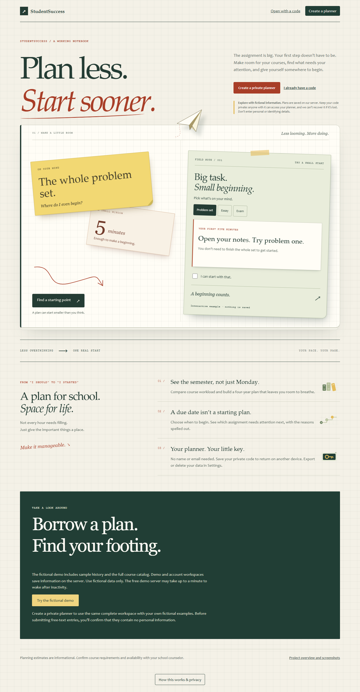
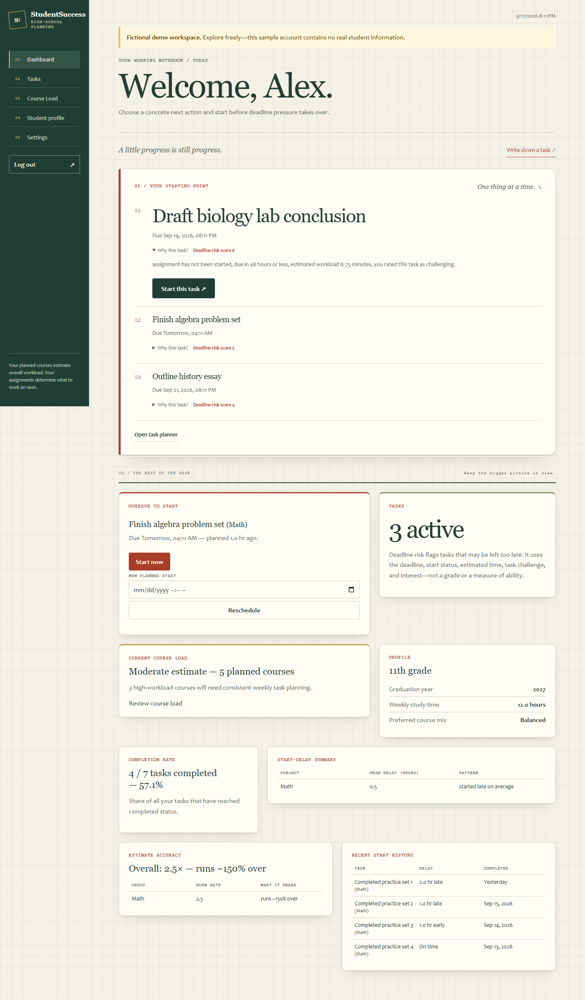

# StudentSuccess

**Plan less. Start sooner.**

StudentSuccess helps high-school students plan a manageable course load and decide which assignment to start next. It brings together four-year course planning, explained task priorities, and feedback on planned versus actual start times.

**[Try StudentSuccess](https://studentsuccess.onrender.com/)** | [Screenshot gallery](docs/screenshots/README.md) | [Project updates](https://studentsuccess.onrender.com/updates)

> Public prototype: explore with fictional information only. The demo server may take about a minute to wake after inactivity.

## Take a look

[View all eleven screenshots](docs/screenshots/README.md), including two-column Settings, the course timeline, mobile layouts, and dark appearance.

## The current workspace

- **A notebook with depth.** Graph paper, layered paper edges, folded corners, soft shadows, and a paper-plane illustration. The landing-page example responds to pointer movement and lets you turn a large assignment into a small first step.
- **A clearer next action.** See a short reason for each recommendation, why the top task comes before the next, and when recorded start history adds a priority nudge. Expand the point breakdown or start the task directly.
- **Less scrolling.** Settings uses two columns on wide screens with a sticky Save button. Logout sits below dashboard navigation, and the desktop sidebar stays in view.
- **Your preferred pace.** Light, dark, and high-contrast appearances; adjustable text, spacing, and focus; reduced-motion support; and expandable summaries on mobile.

## What you can do

- **Choose what to start next.** See task recommendations with plain-language reasons and start the top recommendation directly.
- **Turn deadlines into a starting plan.** Track planned and actual starts, complete assignments, record actual duration, and review timing patterns. Recurring tasks and optional in-app reminders support ongoing work.
- **Compare course options.** Try one-click comparison examples or select up to three courses. See workload tradeoffs, prerequisite and pathway differences, and grade listings. Show only differences and add a choice directly to your plan.
- **Adjust your workspace.** Choose appearance, accessibility, focus, and reminder preferences.
- **Keep control of your plan.** Export account data, download a calendar file, clear completed history, or delete your planner.

## Try it

Choose **Try the fictional demo** to explore a populated sample workspace, or **Create a private planner** for a server-saved workspace without a name or email. Keep its generated access code safe: anyone with it can open the planner, and lost codes cannot be recovered.

An optional browser-only workspace stores its plan on your device and supports manual backups. It does not automatically sync with server accounts.

No automatic welcome popup interrupts browsing. Open **How this works & privacy** whenever you need the explanation. Free-text submissions require confirmation that they contain no personal information; this is a user acknowledgment, not automatic detection.

## About this showcase

This repository contains product information and screenshots only. The application source is maintained privately.

StudentSuccess is a prototype. Recommendations use explicit rules, not AI or machine learning. Course coverage varies, and workload labels are planning estimates. Confirm course availability and requirements with your school counselor. Use fictional information only.
