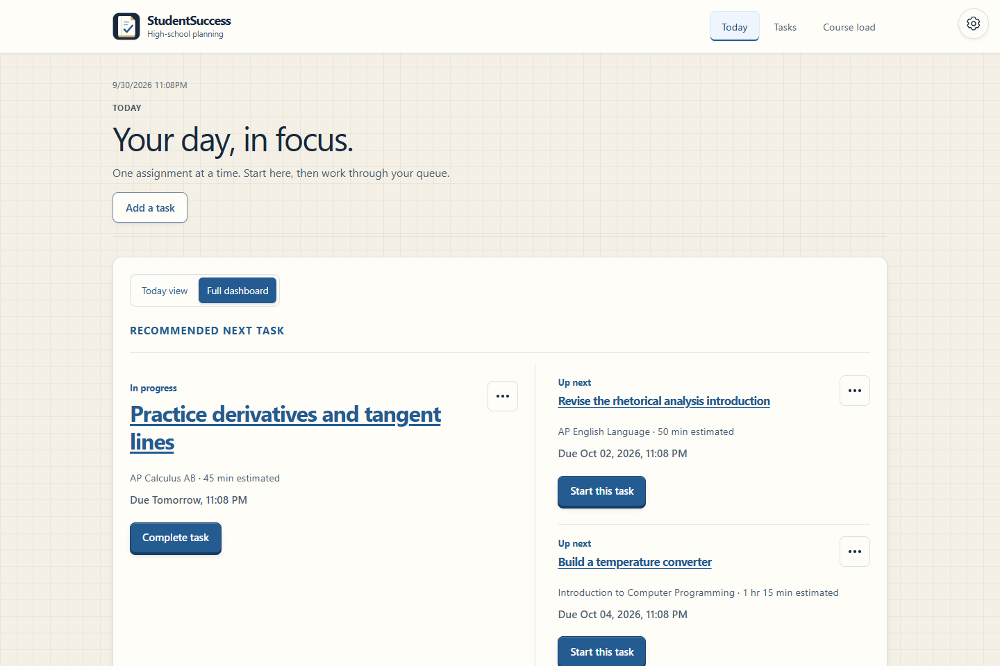
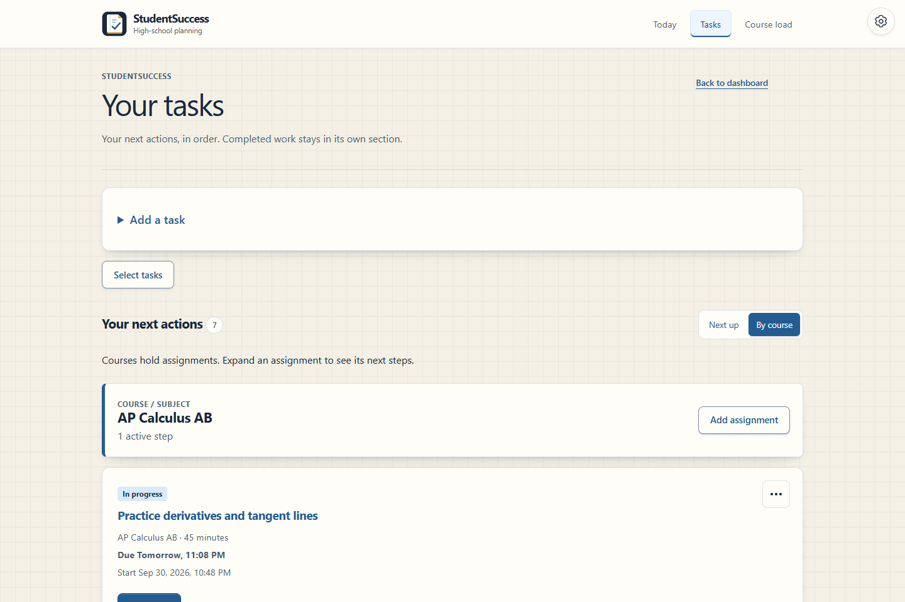
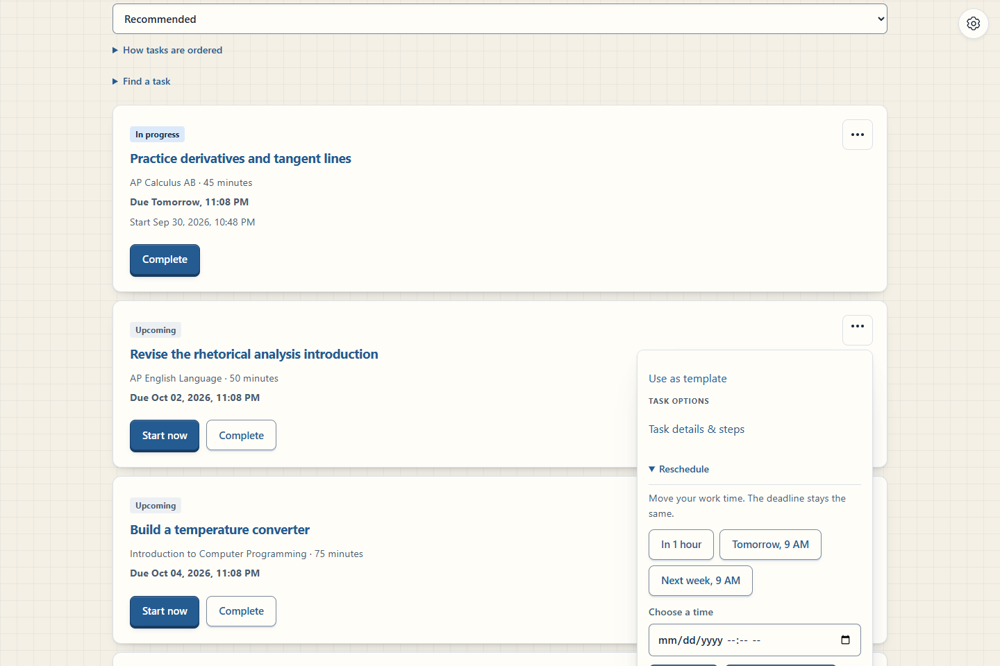
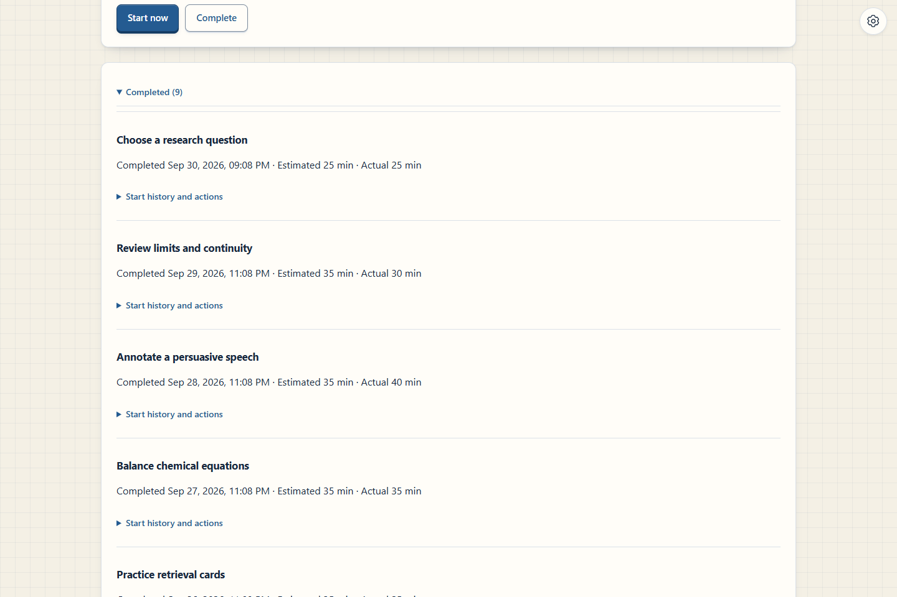
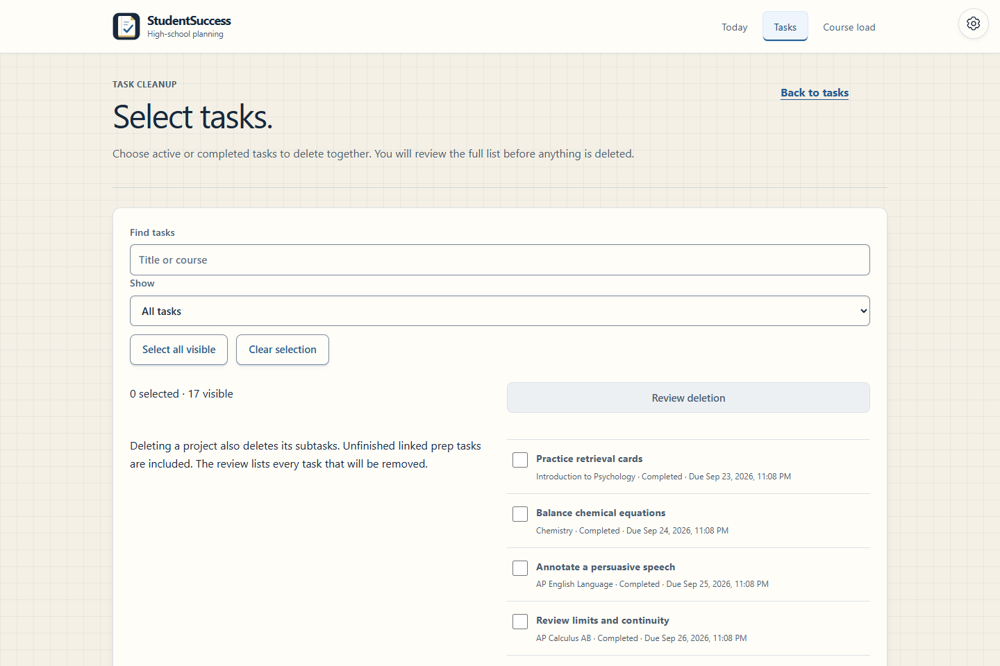
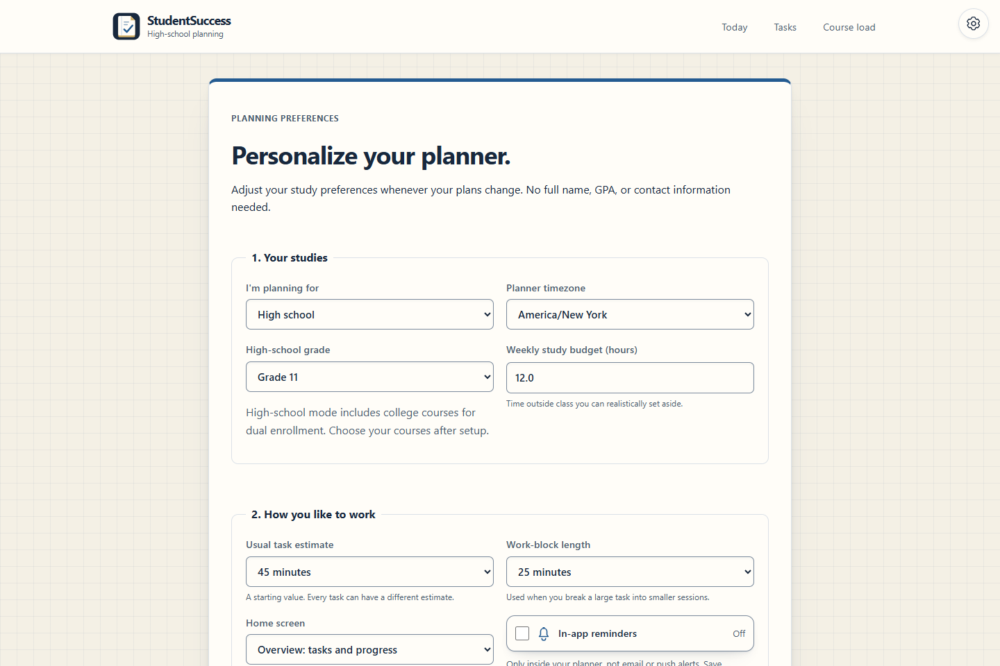

# StudentSuccess: a visual walkthrough

**Plan less. Start sooner.**

An academic planner connecting course choices with daily work for high school, college, and dual-enrollment students.

**[Try the live site](https://studentsuccess.onrender.com/)** | **[Source code and setup](https://github.com/JVijay08/StudentSuccess)** | [Full image gallery](docs/screenshots/README.md)

This showcase is a tour of the product through **20 current screenshots**. For architecture, algorithms, tests, and installation, use the [main repository](https://github.com/JVijay08/StudentSuccess).

Captured September 30, 2026 from the current application with synthetic sample data. Desktop images are 1440 x 960 (3:2); mobile images retain their phone proportions. Click any image to view it at full size.

## Start with a clear next step

The notebook-style landing page introduces the planner and provides a no-registration interactive tutorial.

## Your day, in focus

See the task currently in progress and what comes next. Task menus keep secondary actions out of the way.

## A prioritized task queue

Find assignments in one place, ordered by explained rules. Completed work has its own section.

## See work by course

Group assignments and project steps by subject when you want the bigger picture.

## Turn a project into smaller steps

Break a large assignment into subtasks and track progress. Parent projects remain reachable from the queue.

## Adjust your starting plan

Open the task menu to reschedule. Planned starts and deadlines are separate, and schedule changes offer an undo window.

## Keep a record of finished work

Review completed assignments and estimated versus actual time without cluttering the active queue.

## Manage several tasks together

Select multiple tasks, then review the deletion before confirming.

## Explore high school courses

Browse reference catalogs and compare options. Catalog coverage varies by location and source.

## Compare the tradeoffs

Compare up to three courses by their reference prerequisites, workload labels, and other characteristics.

## Plan across high school

Place courses across grades 9 through 12 and review the planned load.

## High school and college, together

College courses sit within the high school course workspace. Each can belong to a different institution.

## Plan a college term

Organize courses across terms and institutions, with entered credits and weekly study workload.

## Bring deadlines to your calendar

Add deadlines to Google Calendar or use an ICS file. This copies events; it does not automatically synchronize changes.

## Make the planner fit

Required first-time setup establishes education context, timezone, study budget, and planning defaults.

## Personalize the workspace

Adjust appearance, accessibility, planning behavior, and account controls.

## Learn by using real controls

An 18-section guide runs in a separate practice account. Explore freely and exit without changing your own plan.

## Dark appearance

An alternate appearance complements light and high-contrast options.

## A mobile entry point

The landing page adapts to a narrow screen.

## Your planner on a phone

The same task workflow is available at a mobile viewport.

## Try it yourself

Choose **Start tutorial** on the live site to explore an isolated practice workspace without registering. For a persistent planner, create a nickname-style username and password and complete onboarding. No email is required; save your credentials because email recovery is not available.

Actual course names and everyday tasks are welcome. Leave out full names, student IDs, contact details, and sensitive records.

## What these images demonstrate

These are actual application renders, not design mockups. Sample history illustrates the interface, not measured student outcomes. Recommendations use explicit rules, not AI. Workload labels are planning estimates; confirm offerings and requirements with your institution.

The institution directory contains 5,994 IPEDS 2024 entries. It is not a verified catalog of every college course. Calendar tools use manual copies rather than automatic synchronization.

[Read the technical documentation and limitations](https://github.com/JVijay08/StudentSuccess#technical-details) | [View project updates](https://studentsuccess.onrender.com/updates)
