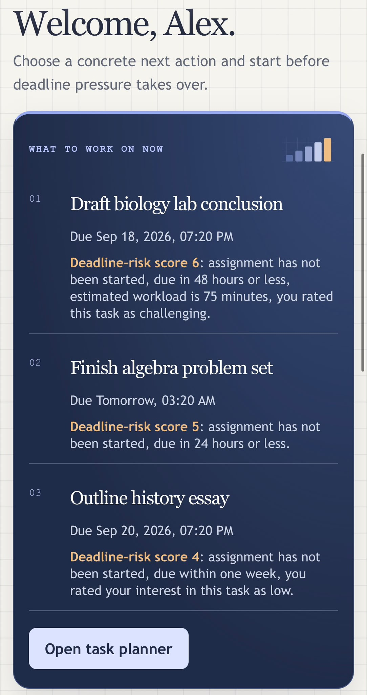

# StudentSuccess screenshots

[Back to the project README](../../README.md)

Captured September 16, 2026 from the public prototype using fictional demo data. Images are the original user-supplied captures. Open an image at full size to read the longer pages.

## Landing page

Entry points for private planners and the fictional demo.

## Dashboard

Explained next actions, due dates, workload, and start-history summaries.

## Task planner

Task entry and a queue of fictional assignments with start and completion controls.

## Course explorer

National reference catalog with filters and course cards.

## Course comparison

Three English course references shown side by side.

## Four-year plan

The demo has five courses in grade 11; the other years are empty.

## Settings

Appearance, focus, planning, reminders, date/time, and account controls.

## Mobile dashboard detail

A close-up of the recommendations on mobile; this capture does not show the full navigation or clock.

