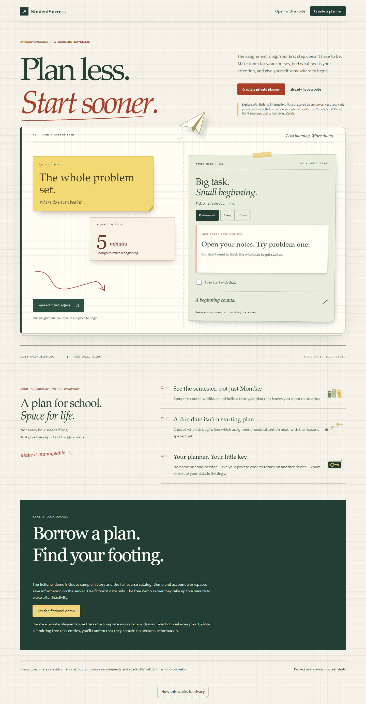
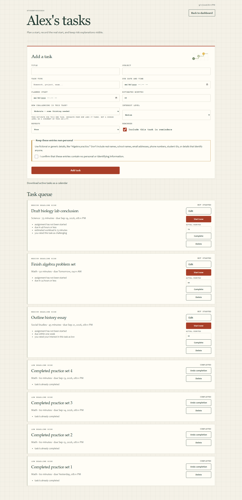
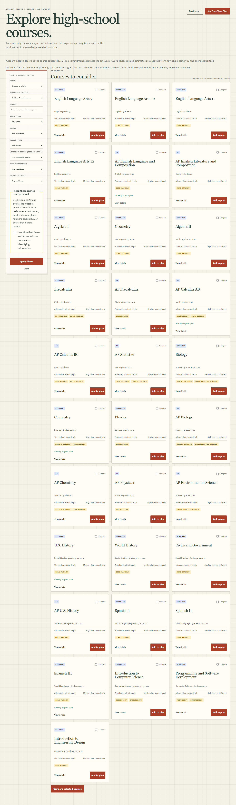
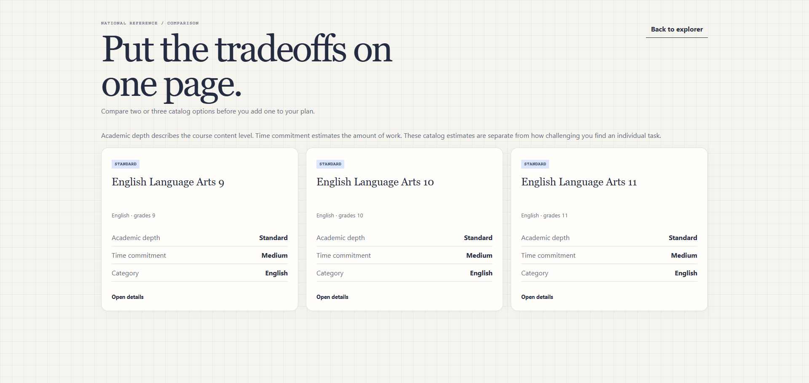
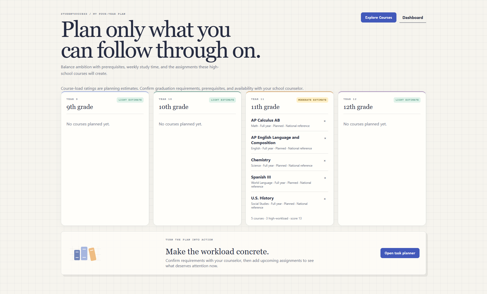
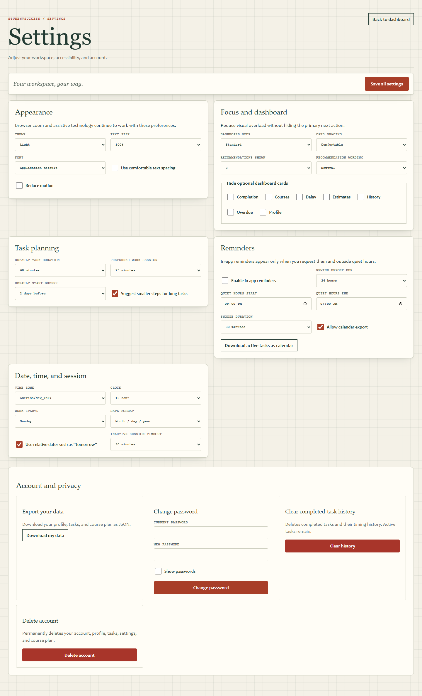
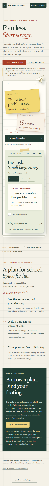
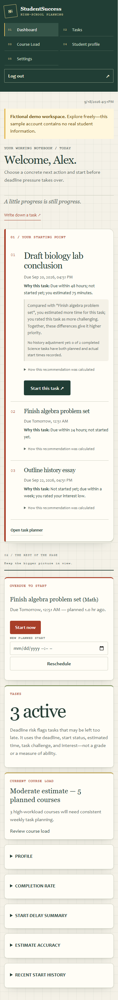
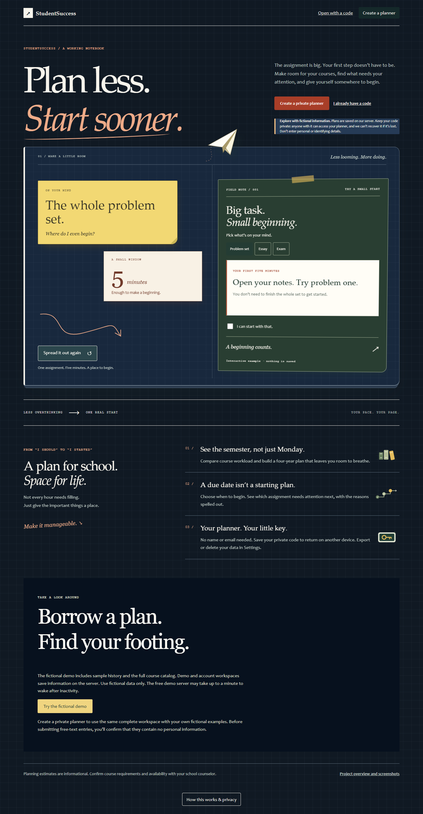

# StudentSuccess screenshots

[Back to the project README](../../README.md)

Captured September 17, 2026; course explorer, comparison, and dashboard views refreshed September 18, 2026. Images are from the current application running locally with isolated fictional demo data. Desktop images are 1440 pixels wide; mobile images are 390 pixels wide. These captures show the design deployed at [StudentSuccess](https://studentsuccess.onrender.com/). Open any image at full size for detail.

Still images do not show motion: try the landing-page example on the live site to see the paper tilt, note arrangement, and paper-plane animation.

## Landing page

Graph paper, layered notes, a folded-paper plane, and entry points for the demo and private planners.

## Interactive starting plan

The example notes settle into a starting plan. Choose a problem set, essay, or exam, then check the first-step box to see the paper-plane animation. Pointer tilt and motion respect reduced-motion preferences.

## Dashboard

A short explanation of the next task, a comparison with the runner-up, visible history context, and an expandable score breakdown. Start the task directly; desktop navigation and logout remain reachable while scrolling.

## Task planner

Task entry and fictional assignments with planned starts, deadlines, start controls, and completion controls.

## Course explorer

National reference courses with one-click comparison examples, selection controls, and a sticky comparison tray. Reference coverage varies by catalog.

## Course comparison

AP Chemistry and AP Biology compared through shared and distinct prerequisites, pathway tags, workload labels, and grade listings. The evidence table can show only differences, and courses can be added directly to the plan.

## Four-year plan

A timeline for grades 9 through 12. This fictional demo has five courses in grade 11; the other years are empty.

## Settings

Two columns on wide screens, a sticky Save all settings button, and appearance, focus, task-planning, reminder, date/time, and account controls.

## Mobile landing page

The interactive notebook adapts to a narrow screen with stacked content and touch-friendly controls.

## Mobile dashboard

Full mobile navigation, logout, clock, task recommendations, summary cards, and expandable supporting information.

## Dark appearance

The same interactive example in dark appearance. High-contrast appearance and reduced motion are also available.

