# StudentSuccess screenshot gallery

[Back to the project README](../../README.md)

Refreshed **September 30, 2026** from the current application running locally. All courses, tasks, and history shown are synthetic demonstration data; no production account or private credentials are included. Desktop images are **1440 x 960 (3:2)**, and phone images are **390 x 844**. These are viewport captures, so content below the fold remains available in the application.

## Landing page

The notebook-style entry point with account creation and the interactive tutorial.

[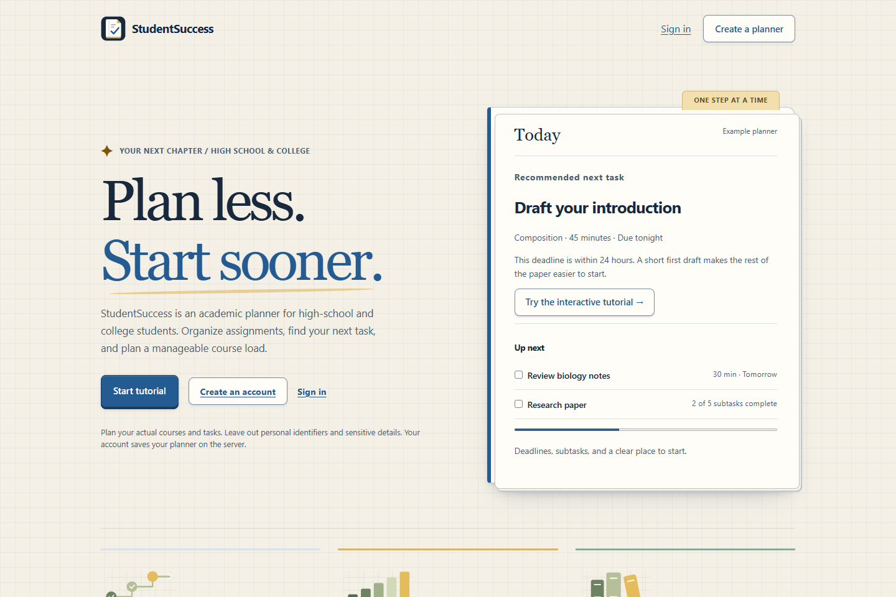](landing.png)

## Dashboard

The recommended next task, clear actions, and supporting planning summaries.

[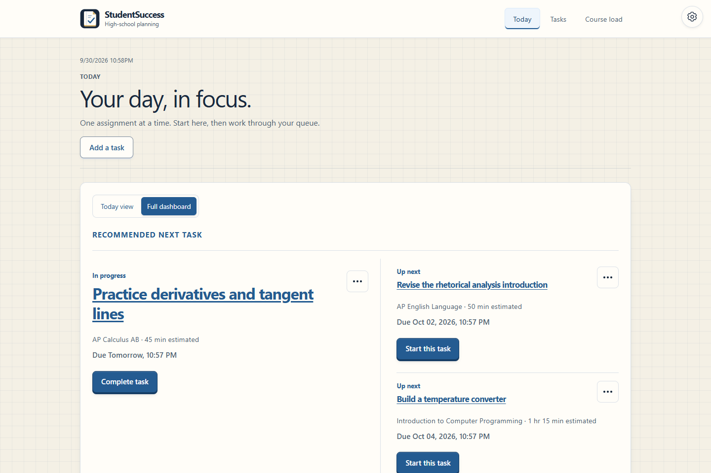](dashboard.png)

## Task queue

Prioritized assignments with task menus and links from subtasks to their parent project.

## Project steps

A larger chemistry assignment broken into smaller steps with progress.

[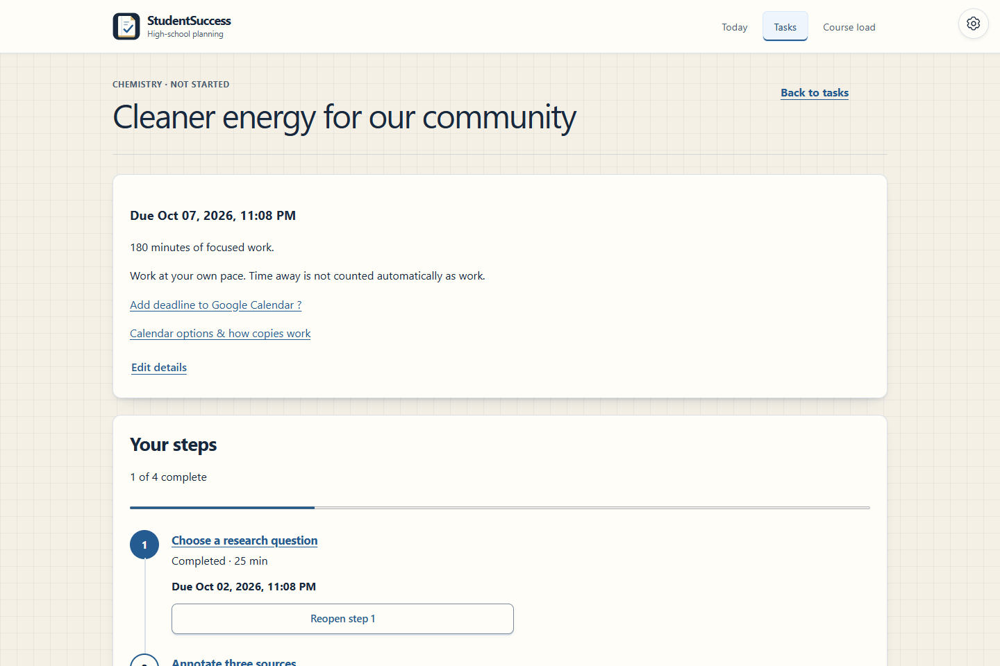](subtasks.png)

## High school course explorer

Reference courses and comparison controls; coverage varies by catalog.

[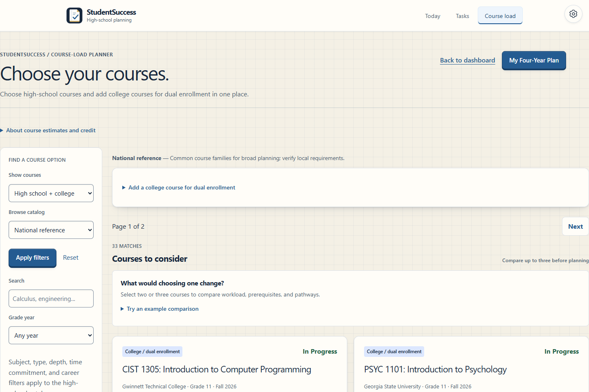](courses.png)

## Integrated dual enrollment

College courses from two institutions within the high school course workspace.

[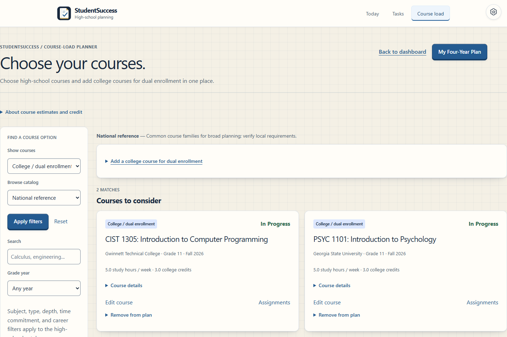](dual-enrollment.png)

## Course comparison

Compare prerequisites, workload labels, and course characteristics.

## Four-year plan

High school planning across grades 9-12.

[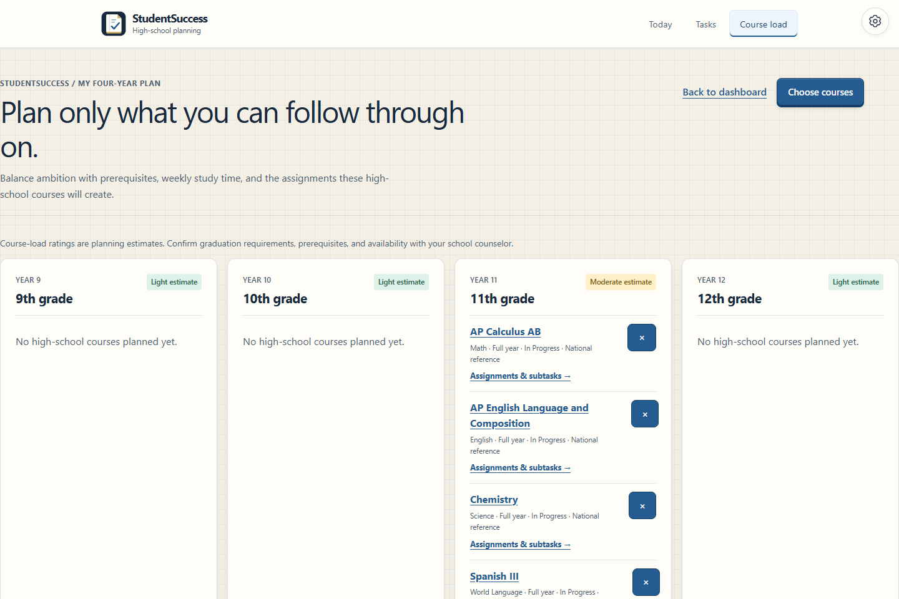](four-year-plan.png)

## College term planning

Term courses, credits, and study workload across institutions.

## Calendar tools

One-way Google Calendar deadline links and calendar-file export/import guidance.

[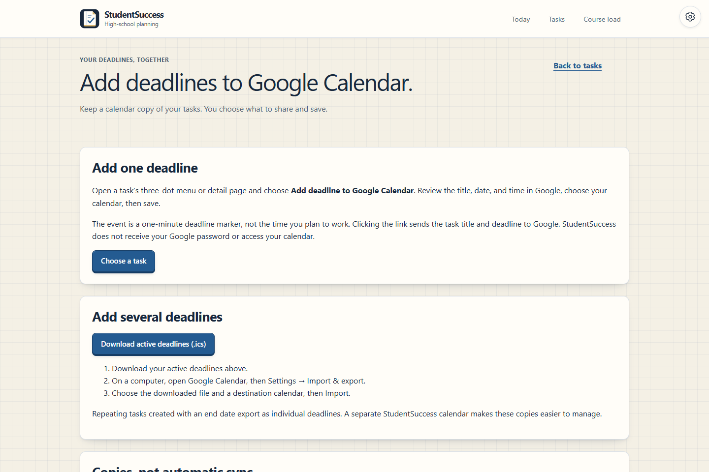](calendar.png)

## Personalization

Academic, display, accessibility, and planning preferences.

[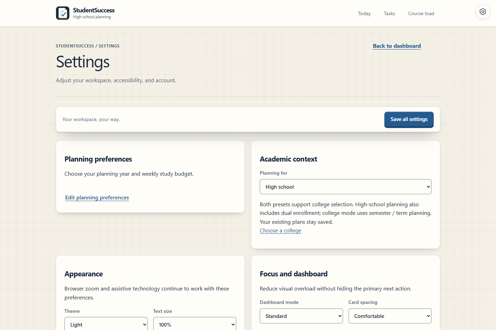](settings.png)

## Interactive tutorial

A guided practice workspace using real site controls.

[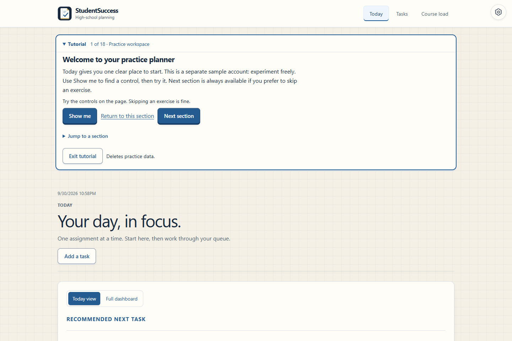](tutorial.png)

## Dark appearance

The landing page using the dark theme.

[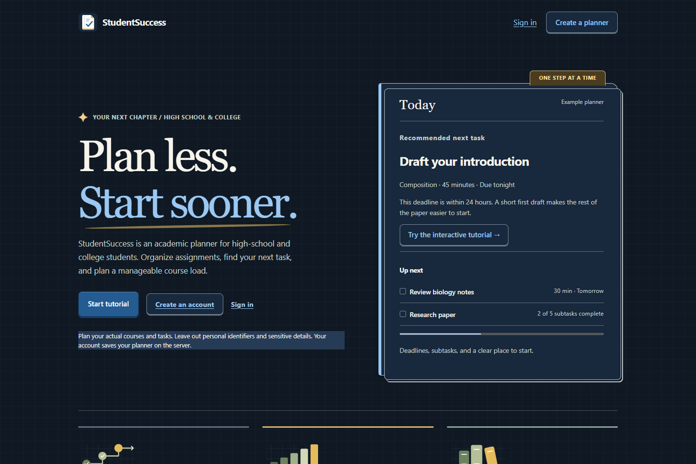](landing-dark.png)

## Mobile landing page

The public entry point at a phone viewport.

[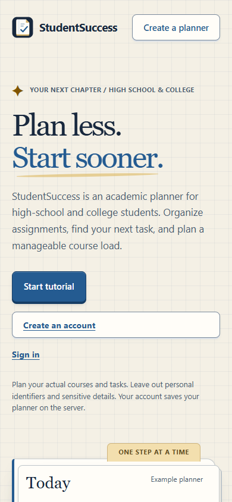](landing-mobile.png)

## Mobile dashboard

The planning workspace at a phone viewport.

## Recreate the gallery

The capture script lives in the public [application repository](https://github.com/JVijay08/StudentSuccess/blob/main/scripts/capture_project_media.py).
It uses a disposable in-memory database, never production accounts. Generated
sample history illustrates features; it is not evidence of measured student outcomes.
